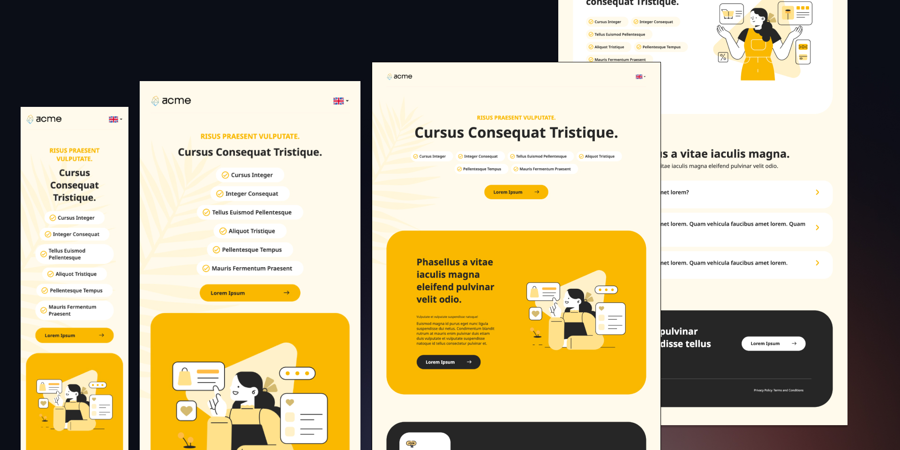

# Acme Co. Landing Page: A Modern Responsive Design

Acme Co. Landing Page is a sleek, mobile-first, and fully responsive landing page designed for businesses and professionals. Built with **Tailwind CSS** and **Pure JavaScript**, this project showcases a modern and minimalist design that adapts seamlessly to all screen sizes.

## Features

- **Mobile-First Design**: Optimized for mobile devices with a responsive layout that scales beautifully to larger screens.
- **Tailwind CSS**: Utility-first CSS framework for rapid and consistent styling.
- **Pure JavaScript**: Lightweight and framework-free scripting for interactivity and dynamic behavior.
- **Modern and Minimalist UI**: Clean and professional design suitable for corporate or business websites.
- **Interactive Elements**: Smooth animations and interactive components powered by vanilla JavaScript.
- **Fully Responsive**: Works flawlessly on desktops, tablets, and mobile devices.

## Technologies Used

- **HTML5**: Semantic markup for structure and accessibility.
- **Tailwind CSS**: Utility-first CSS framework for rapid and responsive design.
- **JavaScript**: Lightweight scripting for interactivity and dynamic behavior.
- **GitHub Pages**: Hosted and deployed using GitHub Pages for easy access.

## Screenshots

  
*The landing page on different screen sizes.*

## How to Use

1. **Clone the Repository**:
   ```bash
   git clone https://github.com/zeynabmvs/acme_landing.git
2. **Install dependencies**:
    ```bash
    npm install

## Live demo

Explore the live demo here: [Acme Co. Landing Page on GitHub Pages](https://zeynabmvs.github.io/acme_landing/)

## Design Credit

The design for this project is sourced from the Figma Community. You can find the original design here: [Figma Design Link](https://www.figma.com/community/file/1198413387972983198)

## Future Enhancements

- Add more sections (e.g., testimonials, pricing plans, or a blog section).
- Integrate a contact form with backend functionality.
- Optimize for performance and accessibility.


Feel free to contribute, report issues, or suggest improvements! Your feedback is highly appreciated.

